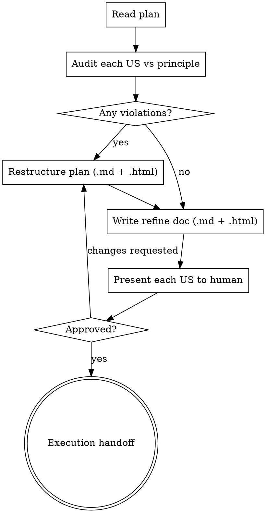

# Refining Plans

## Overview

A plan from `writing-plans` groups its Tasks under **User Stories (US)**. Before any code is written, each US must be a **complete vertical slice** — one service/feature that works end-to-end — and the human must understand and approve every US.

This skill does two things: **nắn US** (audit the slicing and fix violations directly in the plan) and **duyệt** (present each US in plain language and gate execution on human approval).

**Announce at start:** "I'm using the refining-plans skill to refine the plan into vertical-slice User Stories and get your approval."

## The User Story Principle

A User Story is one complete, usable feature — sliced **vertically** through whatever layers it needs (data + logic + UI together), scoped to **one** service/feature.

**A valid US:**
- Is one service/feature, not several mixed together.
- Delivers something usable/testable on its own (a complete vertical slice).
- Example: `US: User logs in with email` — includes the data model, the auth logic, and the login UI needed to make that one feature work.

**Invalid US — reject and fix:**
- ❌ **Layer-split (chẻ ngang):** `US-1 create data types`, `US-2 write logic`, `US-3 build UI`. None of these is usable alone. Merge them into feature-shaped slices.
- ❌ **Feature-mixed (trộn feature):** `US: login + profile editing + notifications`. Split into one US per feature.

## Checklist

Create a todo for each item and complete them in order:

1. **Read the plan** produced by `writing-plans` (the latest file in `docs/superpowers/plans/`).
2. **Audit each US** against the User Story Principle — flag every layer-split and feature-mix.
3. **Restructure violations** directly in the plan `.md` (and regenerate its `.html`): split feature-mixed US, merge layer-split US into vertical slices. Keep the Tasks under their correct US.
4. **Write the refine doc** — `docs/superpowers/refined/YYYY-MM-DD-<feature>-refined.md` (+ `.html`): for each US, explain in plain language *what it does, scope (in/out), acceptance criteria, and which Tasks it contains*.
5. **Approval gate** — present each US to the human and wait. If they request changes, fix the plan + refine doc and present again. Loop until approved.
6. **Execution handoff** — only after approval, offer the execution choice.

## Process Flow



## Audit: How to Spot Violations

For each US in the plan, ask:

- **Is it one feature?** If the title contains "and" joining unrelated features, or the Tasks serve more than one user-facing capability → feature-mixed, split it.
- **Is it usable alone?** If the US only produces types/schemas, or only backend logic with no way to exercise it, or only UI with no backing logic → layer-split, merge it with the slices that complete the feature.
- **Smell test for layer-splitting:** US titles like "data models", "API layer", "frontend", "wiring" are technical layers, not features. Re-slice by feature.

When you restructure, keep every Task — move it under the correct US. Don't lose work; re-group it.

## Refine Doc Format

Save to `docs/superpowers/refined/YYYY-MM-DD-<feature>-refined.md`. One section per US:

```markdown
## US-N: [Feature name — what the user can do]

**What it does:** [1-2 plain sentences a non-engineer understands]

**Scope:**
- In: [what this US includes]
- Out: [what it deliberately excludes / belongs to another US]

**Acceptance:** [how we know this US is done — observable behavior]

**Tasks:** [list the plan's Task numbers/names that build this US]
```

**Human-readable HTML companion:** after writing the `.md`, generate a standalone `.html` at the same path (inline CSS, no external assets) so it opens directly in a browser. Regenerate it whenever the refine doc changes.

## Approval Gate

Present the User Stories to the human:

> "Refined into [N] User Stories, each a complete vertical slice. Refine doc at `docs/superpowers/refined/<file>.md`. Here's what each US does: [short summary per US]. Please review — approve to start implementation, or tell me which US to split/merge/re-scope."

Wait for the response. If they request changes, restructure the plan + refine doc, regenerate the HTML, and present again. **Only proceed once the human approves.**

## Execution Handoff

After approval, offer the execution choice:

**"Plan refined and approved. Two execution options:**

**1. Subagent-Driven (recommended)** - I dispatch a fresh subagent per task, review between tasks, fast iteration

**2. Inline Execution** - Execute tasks in this session using executing-plans, batch execution with checkpoints

**Which approach?"**

**If Subagent-Driven chosen:**
- **REQUIRED SUB-SKILL:** Use superpowers:subagent-driven-development

**If Inline Execution chosen:**
- **REQUIRED SUB-SKILL:** Use superpowers:executing-plans
